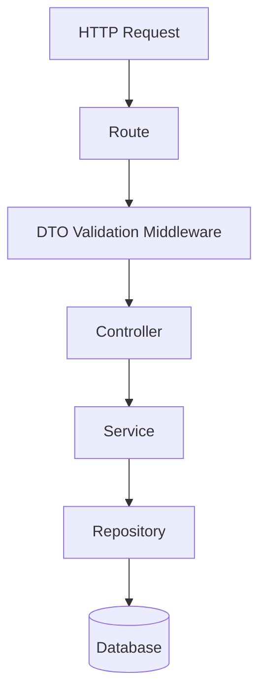

# 🏛️ Project Architecture & Coding Conventions

> **Philosophy:** *Modular Monolith · Uni‑Language · Zero Spaghetti*

This document defines the architectural principles, folder structure, naming rules, validation strategy, data ownership, authentication approach, and anti‑patterns for this codebase. The goal is long‑term maintainability, predictable data flow, and a codebase that can scale without architectural rewrites.

---

## 1. 🏗️ Architecture — The Modular Monolith

We use a **Modular Monolith**: a single deployable application with strong internal boundaries. This avoids microservice overhead while keeping modules cleanly separable if extraction becomes necessary.

### Core Principles

* Feature isolation via modules
* No nested `package.json` files
* No API gateway layer
* Single TypeScript runtime across the stack
* Explicit boundaries between layers

### The “Traffic Cop” Request Flow



**Responsibilities**

| Layer      | Responsibility                    |
| ---------- | --------------------------------- |
| Route      | HTTP mapping only                 |
| Middleware | Validation, auth, request shaping |
| Controller | Orchestration + HTTP responses    |
| Service    | Business rules & decisions        |
| Repository | Database access only              |

---

## 2. 📝 Naming Conventions — Uni‑Language

One naming system across API, services, DTOs, and databases. No translation layers.

### A. File Naming — `kebab-case.role.ts`

| Role       | Example                 |
| ---------- | ----------------------- |
| Service    | `user.service.ts`       |
| Controller | `expense.controller.ts` |
| DTO        | `create-user.dto.ts`    |
| Schema     | `group.schema.ts`       |
| Config     | `better-auth.config.ts` |

### B. Code Naming

| Element          | Convention    | Example           |
| ---------------- | ------------- | ----------------- |
| Classes / Types  | PascalCase    | `UserService`     |
| Functions / Vars | camelCase     | `getUserById`     |
| Constants        | UPPER_SNAKE   | `MAX_RETRY_COUNT` |
| Booleans         | is/has/should | `isVerified`      |

### C. Database Naming (Drizzle & Neo4j)

| Item         | Convention        |
| ------------ | ----------------- |
| Tables       | camelCase, plural |
| Columns      | camelCase         |
| Foreign keys | `<entity>Id`      |

**Outcome:** DTO ⇄ API ⇄ Service ⇄ DB schemas are identical.

---

## 3. 🚫 Anti‑Patterns (Non‑Negotiable)

| Anti‑Pattern    | Why It’s Banned                 |
| --------------- | ------------------------------- |
| `any`           | Breaks type guarantees (pls for the love of god dont use any)  |
| Fat controllers | Violates separation of concerns |
| DTO‑less routes | Runtime safety lost             |
| PII in Neo4j    | Security & consistency risk     |
| Silent errors   | Debugging nightmare             |

---

## 4. 🔄 Suggested Enhancements (drawing board)

### A. Enforce Module Boundaries

Add ESLint rules to prevent cross‑module imports.

### B. Explicit Domain Errors

Introduce domain‑level error classes:

- `UserAlreadyExistsError`
- `InsufficientBalanceError`

Controllers map these to HTTP responses.

### C. Read vs Write Separation

Consider CQRS **inside** modules:

- Write services → business rules
- Read services → optimized queries

### D. Shared Result Type

Standardize service responses:

```ts
Result<T> = { ok: true; value: T } | { ok: false; error: DomainError }
````

we are using "codebase first" db schema migration design
cmds -> $ npx drizzle-kit generate --config=./src/shared/infra/db/postgres/drizzle.config.ts
$ npx drizzle-kit migrate --config=./src/shared/infra/db/postgres/drizzle.config.ts